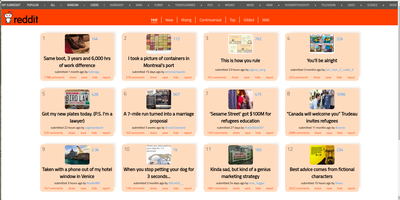
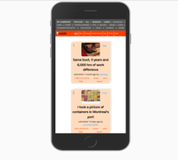

# reddit-redesign

Redesign Reddit Home page

We all love **reddit** so I redesigned reddit's home page,
to allow better user experience.

This is only the home page, meaning the links to other pages would not redirect you
anywhere...

The idea was to provide the users with a more organized layout, with clear devision
between posts, so they will enjoy reddit even more :wink:

To visit the page simply [CLICK HERE](https://veredrec.github.io/reddit-redesign/)

Here are a few screen shots of the **reddit redesigned page**:

